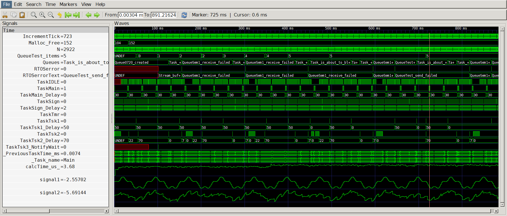
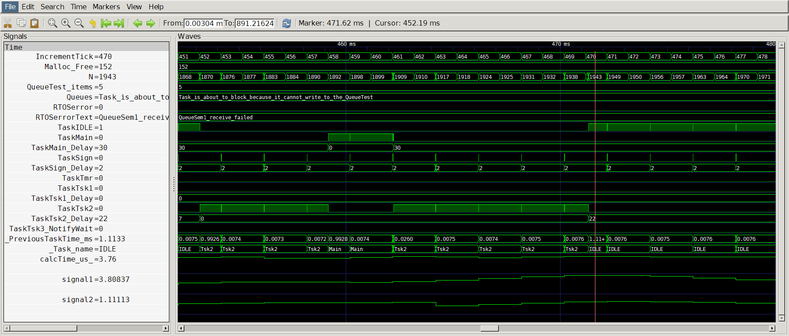
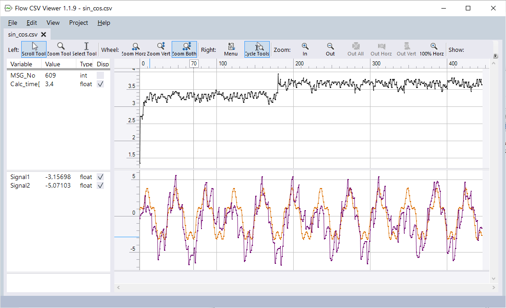

# RTEdbg Data Export and Visualization Possibilities

The **[RTEdbg](https://github.com/RTEdbg/RTEdbg)** library logs data into a circular buffer in binary format. The data is decoded on the host computer after being transferred from the embedded system. The RTEdbg toolkit is based on `fprintf()` functionality, which enables exporting data in various formats. Logged data can be exported (printed) into an arbitrary number of files using customizable formats (e.g., .txt, .log, .csv, etc.). These formats are compatible with various software tools used for reviewing and analyzing log data (from log viewers to graphing and spreadsheet software). Writing the most relevant data to separate files allows test protocols to be exported automatically, thus streamlining the creation of automated testing and documentation.

**Waveform Visualization:** Additionally, the toolkit supports simple and flexible exporting of log data to VCD (Value Change Dump) files. This allows the programmer to focus only on preparing the data using printf-like format definitions, rather than having to deal with the VCD file syntax. <br> See below for a visualization of data from a demo project, showing both the full and zoomed views.




The same data can be exported to, for example, a CSV file and displayed using one of the graphing tools or spreadsheet software - see the example below:



In complex projects, data **can be exported to any number of output files** for graphical, numerical, or textual analysis. Below are a few more excerpts from different log files.

**Example:** Main Log File (all decoded data goes to this file by default)
```
N00108  389.847 MSG0_START_SIN_COS: Sin_cos_demo() function started
N00109  389.856 MSG2_SINCOS_DEMO: -0.764321, -1.8584, 9.34375 us
N00110  389.858 MSGN3_BATT_DEMO: Hex: 000004F4 014D0000 001E9499 
  Battery voltage = 12.68 V, current = 0.00, 
  Charged Ah = 0.0, discharged Ah = 33.3, 
  Temperatures: 26.5, 24.0, SOC: 3.0
N00111  390.846 MSG0_SIMPLE_TEST_START: simple_demo() function started
N00112  390.847 MSG1_UWTICK: Tick 391
N00113  390.847 MSG0_START_SIN_COS: Sin_cos_demo() function started
N00114  390.857 MSG2_SINCOS_DEMO: -0.722788, -1.76581, 9.46875 us
N00115  391.846 MSG1_LONG_TIMESTAMP: 0x5
```

**Example:** RTOS Task Execution Times
```
MSG #  Time[ms] Task name Run time [ms]
---------------------------------------
N00562  130,179 TaskMain  0,9998
N00566  130,187 TaskSign  0,0071
N00569  132,180 TaskMain  1,9930
N00573  132,187 TaskSign  0,0071
N00578  132,213 TaskMain  0,0267
N00583  132,222 TaskTsk3  0,0091
N00586  134,180 TaskIDLE  1,9572
N00590  134,187 TaskSign  0,0073
N00593  136,180 TaskIDLE  1,9927
N00597  136,187 TaskSign  0,0072
N00600  138,180 TaskIDLE  1,9928
N00604  138,187 TaskSign  0,0072
```

**Example:** Errors, warnings, or other critical messages can be exported to a separate file so that they are immediately available for data analysis and do not need to be searched for within long log files. This example is taken from the FreeRTOS `RTOS_errors.log` file.
```
N00453  101,181 Stream buffer 0x20001AC0 receive failed
N00669  155,184 QueueReceive from QueueSem1 failed, ticks to wait 0
N02609  645,184 QueueSend to QueueTest failed
N03272  817,184 QueueReceive from QueueSem1 failed, ticks to wait 0
N03465  867,184 QueueSend to QueueTest failed
```

**Example:** Below is an example of a core dump generated after an exception. Only 32 bytes of additional code and 20 bytes of stack space are required to execute the RTEdbg library function that writes the relevant data to the circular buffer. The complete decoding process is then performed on the host computer.

```
N05529 1203,292 MSGN_FATAL_EXCEPTION: 
CPU registers
  R00:0x64171647, R01:0x200000AC, R02:0x07000000, R03:0x00000259
  R04:0x20000088, R05:0xFC000000, R06:0x2000008C, R07:0x200000A8
  R08:0x00EAC4E1, R09:0x080027B4, R10:0xFA481A48, R11:0x00000064
  R12:0x00000000,  SP:0x2001FF28,  LR:0x03000000,  PC:0x08000938
  xPSR:0x21000000, Flags: Q=0, V=0, C=1, Z=0, N=0
     Interrupted exception: #0 - Thread mode (vector table address: 0x00)
  ICSR: 0x00000803
     Active exception: #3 - HardFault (vector table address: 0x0C)
     Pending exception: #0 - Thread mode (vector table address: 0x00)     
  CFSR:0x00008200       
     Bus fault 
        A data bus error has occurred, and the PC value stacked for the exception return points to the instruction that caused the fault.    
        Valid fault address       
  Offending address:0x07000000
  ```
  See also: [Exception Handler for devices with ARM Cortex-M4 or M7 core](https://github.com/RTEdbg/RTEdbgDemo/blob/master/STM32L433/RTEdbg/Demo_code/Simple_Cortex_M4-M7_fault_handler.md)
